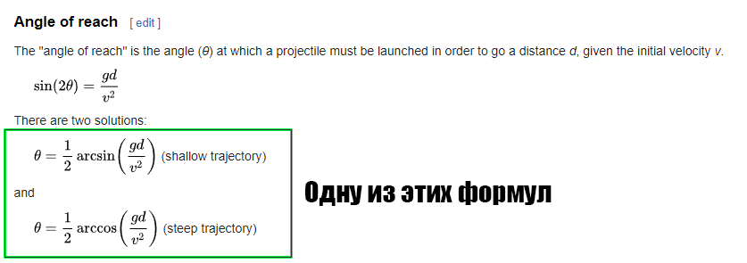

Скачайте архив с проектом AngryBirds. Откройте файл с расширением .csproj в IDE (Visual Studio или Rider). Это простой симулятор системы прицеливания. В файле AngryBirdsTask реализуйте функцию расчета угла прицеливания, в зависимости от начальной скорости снаряда и дальности до цели. Если решения не существует, метод должен возвращать double.NaN.

Проверьте корректность своего решения, запустив проект.

Вы можете изучить устройство проекта — это будет полезно, но для выполнения этого задания это совсем не обязательно. Более того, будьте готовы к тому, что в проекте активно используются ещё не пройденные темы.

Детали:

1. Сопротивлением воздуха можно пренебречь
2. Ускорение свободного падения g = 9.8 м/с2
3. Иногда может существовать два решения: навесной траекторией и прямой наводкой. Вам нужно решение прямой наводкой, то есть с минимальным временем подлёта снаряда.

Сайт откуда брал формулу: https://en.wikipedia.org/wiki/Projectile_motion#Angle_of_reach

Картинка с формулой:

